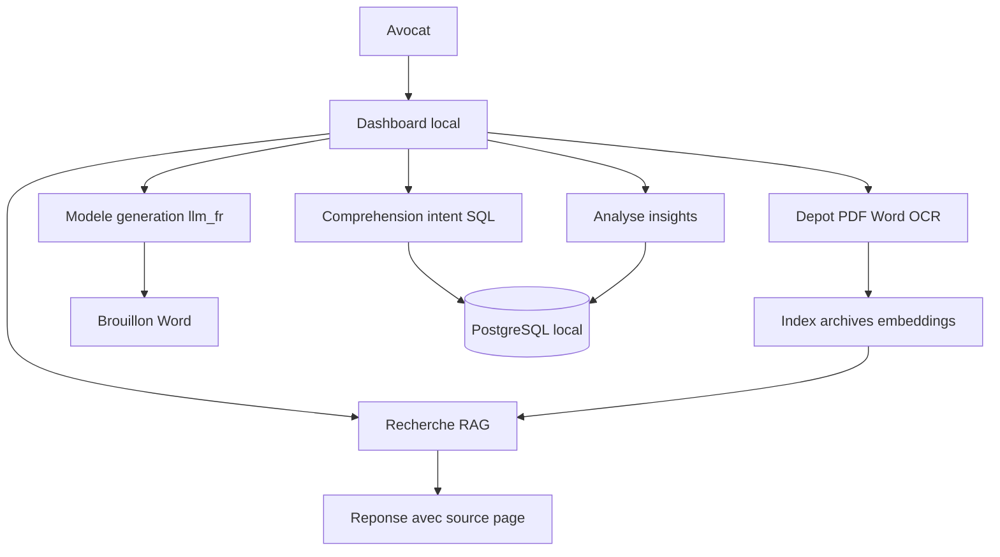

# Architecture DATTY AI — IA juridique locale

Version T1 — 3 octobre 2026

## Vision produit

Une IA qui tourne **dans le cabinet d'avocats**, sans envoi de documents vers le cloud. Cible : cabinets de 1 à 15 avocats. L'avocat reste responsable ; l'outil résume, cherche et prépare des brouillons.

## Trois moteurs

| Moteur | Rôle | Technologie T1/T2 |
|--------|------|-------------------|
| 1. Compréhension | Intent → requêtes structurées | SQL Engine → PostgreSQL local |
| 2. Génération | Résumés, brouillons d'actes | `llm_fr` (Transformer causal entraîné) |
| 3. Analyse | Insights, statistiques dossier | Agrégations + modèle |

Sortie commune : **Dashboard Engine** (interface locale).

## Schéma global



## Pipeline technique actuel (`llm_fr`)

```
download → prepare → train → generate/chat/evaluate
```

| Module | Fichier | Rôle |
|--------|---------|------|
| Collecte | `download.py`, `download_legal.py` | Corpus Wikipédia / juridique |
| Préparation | `prepare.py`, `corpus.py` | Tokenizer BPE, binaires |
| Modèle | `model.py` | Transformer causal |
| Entraînement | `train.py` | Optimisation, checkpoints |
| Inférence | `generate.py`, `chat.py` | Continuations, session interactive |
| Évaluation | `evaluate.py` | Comparaison checkpoints |

État T1 : pilote Wikipédia 500 articles, 510 steps, `runs/pilot/best.pt`.

## MVP — périmètre strict (story mapping)

Parcours minimum démontrable :

1. **Dépôt** — Nathalie dépose un dossier (PDF, Word)
2. **Résumé** — Sophie obtient un résumé une page
3. **Recherche** — Léa pose une question, réponse avec source document + page
4. **Brouillon** — Export Word d'un premier jet, relecture obligatoire

Tout fonctionne **sans internet** une fois installé.

## Décisions T1

| Question | Décision T1 | T2 |
|----------|-------------|-----|
| MVP = génération seule ou + RAG ? | Les deux : génération (`llm_fr`) + RAG minimal pour citations | Index embeddings |
| Contexte 128 tokens | Insuffisant pour gros dossiers | Découpage + résumé hiérarchique |
| Où vivent les poids | Code → GitHub ; checkpoints → HuggingFace | À publier après entraînement juridique |
| Données | Wikipédia pilote + échantillon juridique | Légifrance, Judilibre, modèles anonymisés |

## Sécurité et conformité

- **100 % local** — aucun appel API externe en production
- **Secret professionnel** — différenciateur vs Ordalie, Jimini, ChatGPT
- **Historique des demandes** — traçabilité (guide CNB)
- **Droits par utilisateur** — V1
- **Relecture obligatoire** — pas de conseil juridique autonome

## Hébergement des artefacts

| Artefact | Emplacement |
|----------|-------------|
| Code source | GitHub (`Kapopopo/EDP_Project`, branche `P.A` pour tests) |
| Poids modèle | HuggingFace (à publier) |
| Données brutes | `data/` (exclu de Git via `.gitignore`) |
| Checkpoints | `runs/` (exclu de Git) |

## Roadmap technique

| Trimestre | Focus |
|-----------|-------|
| T1 | Tests, pilote Mac, corpus juridique échantillon, architecture |
| T2 | Entraînement juridique, RAG minimal, premiers écrans |
| T3 | Dashboard, GPU, contexte long, démo sans internet |
| T4 | Tests utilisateurs, sécurité V1, soutenance |
